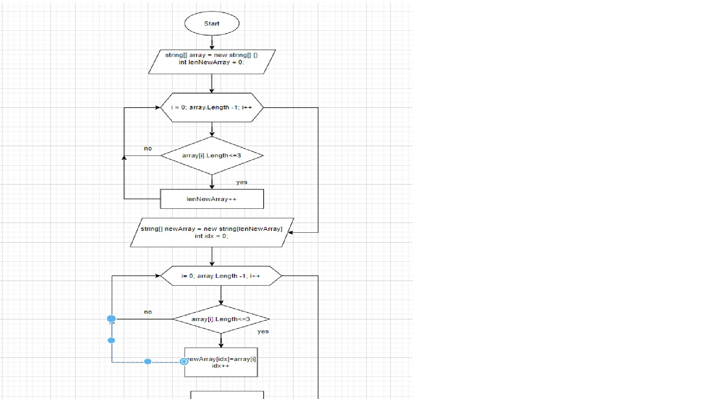

# Final_project_GB

# Содержание проекта:

1. Условие задачи проверочной работы;
2. Блок-схема алгоритма основного метода решения задачи;
3. Программа в виде консольного приложения.

# 1. Задача:
Написать программу, которая из имеющегося массива строк формирует массив из строк, длина которых меньше либо равна 3 символам. Первоначальный массив можно ввести с клавиатуры, либо задать на старте выполнения алгоритма.

Примеры:

["hello","2","world",":-)",]->["2",":-)"]

["1234","1567","-2","computer scince"]->["-2"]

["Russia","Denmark","Kazan"]->[]

# 2. Блок-схема алгоритма

# 3. Структура и описание кода приложения:

